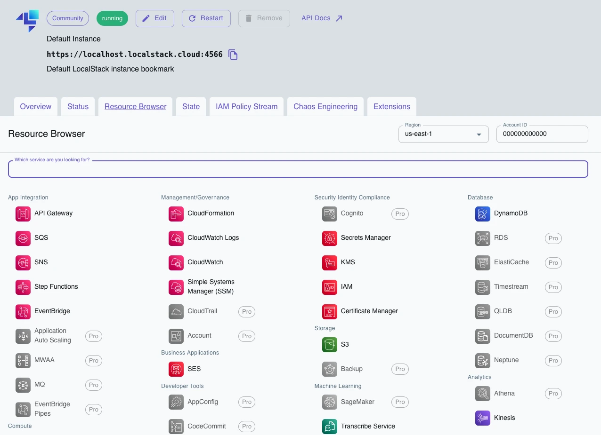

# LocalStack Demo Application

This application demonstrates how to use **LocalStack**, a fully functional local AWS cloud emulator. It simulates the core AWS services locally, allowing developers to test and debug their applications without requiring real AWS cloud infrastructure.

---

## What is LocalStack?

LocalStack is a powerful tool for local development and testing of AWS applications. It provides a lightweight and fast alternative to interacting with AWS services by emulating their APIs and behaviors locally. Developers can run their applications using LocalStack without the need for actual AWS credentials or internet access.

**Supported AWS Services:**
- Amazon S3
- Amazon SQS
- Amazon DynamoDB
- Amazon SNS
- Lambda
- And many more...

**Use Cases:**
- Debugging and testing cloud-native applications
- CI/CD pipelines for AWS applications
- Offline development with AWS APIs

---

## Features of this Demo

This demo application showcases how to:
1. Create and interact with a **SQS Queue**.
2. Set up and query a **DynamoDB Table**.
3. Create and interact with a**Parameter Store**.
4. Use **Spring Cloud AWS** to interact with those AWS tools seamlessly.

---

## Prerequisites

1. **Install Docker or Podman:**
   LocalStack runs inside a container. Make sure you have either Docker or Podman installed.

2**Java Development Environment:**
    - JDK 21 or higher

---

## How to Start the Application

### Step 1: Clone the Repository
```bash
git clone https://github.com/vincenzo-racca/localstack.git
cd localstack
```

### Step 2: Set Up LocalStack
1. From the root directory, start LocalStack using Podman Compose:
   ```bash
   podman compose up -d
   ```
   or Docker Compose:
   ```bash
   docker compose up -d
   ```

### Step 3: Verify LocalStack is Running
Check the logs to ensure LocalStack has started correctly:
```bash
podman compose logs localstack
```
or
```bash
docker compose logs localstack
```

### Step 4: Build and Run the Java Application
Run the Java application using the Maven wrapper:
```bash
./mvnw clean spring-boot:run
```

### Step 5: Test the Application
Use the application to:
- Send messages to the SQS Queue.
- Query or insert data into the DynamoDB Table.
- Monitor AWS resources created with LocalStack by going to [LocalStack cloud](https://app.localstack.cloud/inst/default/resources)



---

## Stopping the Application
To stop LocalStack and clean up resources:
```bash
podman compose down
```
or
```bash
docker compose down
```

---

## Additional Resources
- [LocalStack Documentation](https://docs.localstack.cloud/)
- [AWS SDK for Java](https://docs.aws.amazon.com/sdk-for-java/latest/developer-guide/)
- [Spring Cloud AWS Documentation](https://spring.io/projects/spring-cloud-aws)

---

Happy coding with LocalStack! 🚀